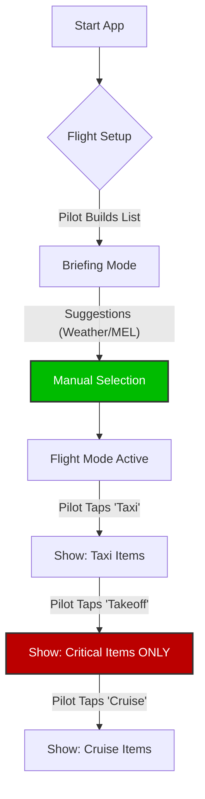

Based on the core requirement to reduce cognitive load and the constraints of the cockpit environment (iPad EFB, turbulence, variable lighting), here is the UX design strategy for the **Pilot Recall Assistant (PRA)**.

The interface prioritizes **clarity over density** and **predictability over smartness**.

### 1. The "Phase-Aware Recall" View (In-Flight Mode)

This is the "Silent Dashboard" the pilot sees while flying. It must convey "Tier-1" information instantly without requiring interaction.

**Design Philosophy:** *The "glanceable" interface.*

* **Layout Strategy:**
* **The "Phase Rail" (Top or Left):** A high-contrast, persistent indicator of the current flight phase (e.g., **TAXI OUT**). It acts as the "State Anchor" so the pilot always knows *why* specific items are shown.

* **The Card Stack:** A vertical list of "Recall Cards."
* 
**"Quiet" Filtering:** As the pilot advances the phase, irrelevant cards vanish instantly, and new relevant ones appear without complex animations that could distract peripheral vision.

* **The Recall Card Component:**
* **Visual Hierarchy:**
1. 
**Title (H1):** Large, bold text (e.g., **"Anti-Ice ON"**) for 0.5s recognition.

2. **Constraint Note (Body):** Yellow-tinted background block for pilot-authored notes (e.g., *"Engine run-ups required every 15 mins"*). The color distinction signals "This is MY memory," not official text.

3. **Authority Link (Footer):** A distinct, blue-styled text pointer (e.g., `REF: FCOM 3.04.22`). It looks like a button but acts as a reference anchor.

* 
**TEM Badge:** A small, red-bordered section for "Threats" only appears if the pilot added specific TEM logic.

* **Cognitive Load Optimization:**
* **Critical Phase Mode:** During Takeoff/Landing, the UI enters a "Dark Mode" equivalent where *only* items marked "Tier-1" remain visible. All other UI chrome (menus, settings) fades out.

### 2. The "Item Creation" Form (Pre-Flight Preparation)

This interface is used on the ground. It is designed to be a "structured capture of the pilot's mental model".

**Design Philosophy:** *Frictionless data entry.*

* **Layout Strategy:**
* **Split View (iPad Landscape):**
* **Left Pane (Input):** Large, touch-friendly form fields.
* **Right Pane (Preview):** A live preview of how the card will look in flight. This builds trust that "what I type is exactly what I will see".

* **Phase Toggles:** Instead of a dropdown menu (which requires two taps), use a **Segmented Toggle Row** for phases. The pilot can tap multiple phases (e.g., `[Taxi]`, `[Takeoff]`) in rapid succession.

* **Input Efficiency:**
* **Smart Keyboards:** When typing in the "Reference" field, the keyboard switches to a number-optimized layout (for entering "3.04.22").
* **Media Drop Zone:** A large, dashed-border area for "Tap to Snap" or "Paste Screenshot." This is critical for capturing complex charts without re-typing them.

### 3. The "Flight List Builder" (Briefing Mode)

This is where the pilot "builds" the mission strategy.

**Design Philosophy:** *Explicit Consent.*

* **Layout Strategy:**
* **Two-Column Drag & Drop:**
* 
**Left Column ("Library/Suggestions"):** Items suggested by context (e.g., "Cold Weather Ops" because temp < 0°C).

* 
**Right Column ("My Flight List"):** The definitive list for this specific flight.

* **The "Commit" Action:** The pilot must physically tap or drag an item from Left to Right to include it. This physical action reinforces the "Pilot Authority" principle—the AI suggests, but the pilot decides.

* **Cognitive Safety:**
* 
**No "Select All":** Deliberately omit a "Select All" button to force individual consideration of each constraint.

### 4. General UI Tactics for Efficiency

* **Typography:** Use the system native font (San Francisco on iOS) to ensure maximum legibility and familiarity. Minimum font size of 16pt to prevent eye strain.
* 
**Touch Targets:** adhere to Apple's **44x44pt minimum** touch target size to accommodate usage during turbulence.

* 
**Contrast:** High contrast "Day Mode" (white background, black text) and "Night Cockpit Mode" (true black background, amber/red text) to preserve night vision.

### 5. Interaction Flow Diagram

The following text-based schematic illustrates the "Zero Latency" flow:

